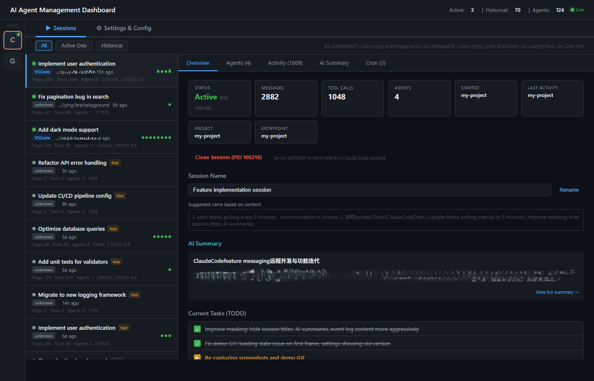

<p align="center">
  <h1 align="center">AgentPulse</h1>
  <p align="center">
    <strong>A unified management dashboard for AI coding agents.</strong><br>
    Monitor sessions, manage configurations, and track activity across Claude Code, GitHub Copilot, and more — all from one place.
  </p>
  <p align="center">
    <a href="https://www.npmjs.com/package/agentpulse"></a>
    <a href="https://github.com/cdlliuy/AgentPulse/blob/main/LICENSE"></a>
    <a href="https://www.npmjs.com/package/agentpulse"></a>
  </p>
</p>

---

## The Problem

AI coding agents are powerful, but managing them is chaotic:

- **Sessions scatter everywhere** — multiple agents running simultaneously with no central view
- **Context gets lost** — session history, AI-generated insights, and configuration changes disappear on restart
- **Configuration fragments** — settings, skills, memory files, and MCP servers spread across different locations and formats
- **No visibility** — hard to see what agents are doing, what they've done, and what's queued

## The Solution

AgentPulse is a **local-first, zero-config dashboard** that automatically discovers and visualizes your AI agent ecosystem. No databases, no cloud services, no setup — just install and open.

## Who Is This For?

Developers who use AI coding agents (Claude Code, GitHub Copilot, etc.) daily and want a **single place** to monitor sessions, manage configurations, and review activity — instead of juggling scattered files, terminal windows, and config locations.

## Demo



## Features

### Session Management

| Capability | Description |
|-----------|-------------|
| **Live monitoring** | Real-time view of all active and historical sessions via WebSocket |
| **Multi-agent support** | Claude Code and GitHub Copilot side by side, with extensible agent architecture |
| **Session control** | Rename, close, and organize sessions from one place |
| **Status at a glance** | Active (green) vs. ended sessions, PID tracking, project grouping |

### AI-Powered Summaries

| Capability | Description |
|-----------|-------------|
| **One-click summaries** | Generate AI-powered analysis of any session via `claude -p` |
| **Brief naming** | Auto-suggest meaningful session names from conversation content |
| **Persistent storage** | Summaries survive server restarts, cached for fast access |
| **Title editing** | Modify titles of completed sessions directly in the log |

### Configuration Center

| Capability | Description |
|-----------|-------------|
| **Global & project settings** | Unified view of `settings.json`, `.claude.json`, and per-project overrides |
| **CLAUDE.md editor** | Read and edit global instructions that guide agent behavior |
| **Memory management** | Browse, edit, and delete memory files across all projects |
| **MCP server overview** | See all configured MCP servers with masked credentials |
| **Skills inventory** | Slash commands and skills organized by scope (global vs. project) |

### Activity & Event Log

| Capability | Description |
|-----------|-------------|
| **Curated Event Log** | Filtered, deduplicated view of session events (oldest first) |
| **Full Timeline** | Detailed visual workflow timeline (newest first) |
| **Smart deduplication** | Consecutive identical events collapsed with count badges |
| **Flexible filtering** | Filter by type: substantive, user-only, remote input, agents, or all |
| **Cron job tracking** | View active and historical cron jobs across all sessions |

## Quick Start

### Install from npm

```bash
npm install -g agentpulse
agentpulse
```

Or run without installing:

```bash
npx agentpulse
```

### Install from source

```bash
git clone https://github.com/cdlliuy/AgentPulse.git
cd AgentPulse
npm install
npm start
```

Open **http://localhost:3456** in your browser. Custom port:

```bash
PORT=8080 agentpulse
```

### Run in background

```bash
PORT=3456 nohup agentpulse > agentpulse.log 2>&1 & echo $! > agentpulse.pid
```

## How It Works

### Zero Configuration

AgentPulse auto-discovers everything from standard locations — no config file needed:

| Data | Source |
|------|--------|
| Sessions | `~/.claude/sessions/` and `~/.claude/projects/*/` |
| Settings | `~/.claude/settings.json` and `~/.claude.json` |
| Memory | `~/.claude/projects/*/memory/` |
| Skills | `~/.claude/commands/` and `.claude/commands/` |
| Copilot | `~/.copilot/` |

### Architecture

Deliberately simple — no build step, no framework, no database:

| Component | What |
|-----------|------|
| `server.js` | Express server with REST API + WebSocket — all business logic in one file |
| `public/index.html` | Vanilla JS frontend — no framework, no build step |
| Dependencies | Just 2: `express` and `ws` |

### API

22 REST endpoints + WebSocket for real-time updates:

```
GET  /api/sessions          — list all sessions
GET  /api/sessions/:id      — session detail with full event timeline
POST /api/sessions/:id/close — terminate an active session
POST /api/sessions/:id/ai-summary — generate AI summary
GET  /api/settings          — global + project settings
GET  /api/memory            — memory files across projects
GET  /api/projects          — all projects with configs
WS   ws://localhost:3456    — real-time session updates (5s interval)
```

## Contributing

```bash
npm install
npm test          # 96 tests, ~85% coverage
npm run dev       # start dev server
```

See the [contributor guide](README.md#for-contributors) section below for code style rules, testing requirements, and review checklist.

---

## For Contributors

### Project Structure

```
agentpulse/
  server.js          — Express server, REST APIs, WebSocket, all business logic
  server.test.js     — Jest + Supertest tests (96 tests, ~85% line coverage)
  public/index.html  — Single-page frontend (vanilla JS, no framework)
  package.json       — Dependencies: express, ws; devDeps: jest, supertest
  LICENSE            — MIT License
```

### Code Style

- **No build step** — runs directly in Node.js, no TypeScript, no bundler
- **Single-file architecture** — server in `server.js`, frontend in `index.html`
- **Extract shared helpers** — deduplicate after 3+ occurrences
- **Mask sensitive data** — all MCP env configs pass through `maskMcpEnv()`

### Testing

```bash
npm test                # all tests must pass
npx jest --coverage     # maintain >80% line coverage
```

### Code Review Checklist

- [ ] All 96+ tests pass
- [ ] No coverage regression (>80%)
- [ ] No duplicated logic
- [ ] Sensitive data masked
- [ ] No unnecessary new dependencies

## License

[MIT](LICENSE) — Ying Liu
